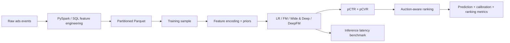

# Ads Ranking Pipeline for CTR/CVR Prediction

Production-inspired ads ranking ML project covering CTR/CVR prediction, feature interaction
models, probability calibration, auction-aware ranking, Spark-based offline feature engineering, and
inference benchmarking.

The core problem:

```text
Given a user request and candidate ads, predict pCTR and pCVR, then rank ads by expected value.
```

The synthetic full-funnel track uses:

```text
expected_value_score = pCTR * pCVR * bid
```

The real-world track is designed for public ads samples such as Ali-CCP, where full auction fields
are not always available.

## Architecture



## Tracks

| Track | Purpose | Status |
| --- | --- | --- |
| Synthetic full-funnel simulation | Validate CTR/CVR/bid/ranking/calibration logic in a controlled ads environment. | Implemented |
| Real-world ads benchmark | Run CTR/CVR model experiments on preprocessed public ads samples such as Ali-CCP. | Loader ready, sample pending |
| Big-data feature engineering | Mirror production offline feature workflows with PySpark, SQL, and partitioned Parquet. | Implemented |
| Serving benchmark | Compare model complexity and inference latency. | Implemented |

## Implemented Capabilities

- CTR and conditional CVR modeling.
- Logistic Regression, Factorization Machine, Wide & Deep, and DeepFM baselines.
- Historical CTR/CVR prior features with train-fitted leakage control.
- Feature ablation for base vs engineered features.
- Probability calibration metrics: Brier Score and Expected Calibration Error.
- Auction-aware synthetic ranking with `pCTR * pCVR * bid`.
- Ranking metrics: NDCG@K and top-1 conversion rate.
- Local PySpark feature engineering and partitioned Parquet output.
- SQL feature examples for Hive/Presto/Trino/BigQuery/Snowflake-style workflows.
- Inference benchmark with parameter count, average latency, p95 latency, and throughput.

## Project Structure

```text
ads-ranking-pipeline/
  configs/
    default.json
    aliccp_sample.json
    benchmark.json
    spark_features.json
  docs/
    big_data_workflow.md
    decision_log.md
    project_explanation.md
    sql_feature_examples.sql
  scripts/
    run_demo.py
    run_experiments.py
    run_feature_ablation.py
    run_aliccp_sample.py
    spark_build_features.py
    benchmark_inference.py
  src/ads_ranking/
    bigdata/
    datasets/
    models/
    ranking/
    calibration.py
    data.py
    evaluation.py
    experiments.py
    features.py
    train.py
```

## Quick Start

```bash
python3 -m venv .venv
source .venv/bin/activate
pip install -r requirements.txt
python scripts/run_demo.py
```

## Main Commands

Run synthetic model comparison:

```bash
python scripts/run_experiments.py
```

Run feature ablation:

```bash
python scripts/run_feature_ablation.py
```

Build local Spark features and partitioned Parquet outputs:

```bash
JAVA_HOME=$(/usr/libexec/java_home -v 17) python scripts/spark_build_features.py
```

Run inference benchmark:

```bash
python scripts/benchmark_inference.py
```

Run Ali-CCP sample experiment after creating `data/aliccp/sample.csv`:

```bash
python scripts/run_aliccp_sample.py
```

Generated data and experiment outputs are written to `data/` and `outputs/`, both ignored by Git.

## Current Results

Synthetic model comparison:

```text
model                  ctr_auc  ctr_logloss  ctr_brier  ctr_ece  cvr_auc  cvr_logloss  cvr_brier  cvr_ece  ndcg@5  top1_conversion_rate
logistic_regression     0.5761       0.6605     0.2145   0.1180   0.5260       0.7021     0.2339   0.1525  0.8114                0.1075
factorization_machine   0.6122       0.6694     0.2242   0.1338   0.5325       0.7612     0.2531   0.1915  0.8208                0.1122
wide_deep               0.7450       0.5075     0.1682   0.0156   0.6684       0.5500     0.1836   0.0102  0.8727                0.1345
deepfm                  0.7362       0.5154     0.1713   0.0260   0.6402       0.5656     0.1895   0.0296  0.8665                0.1322
```

Feature ablation:

```text
feature_set   model      ctr_auc  ctr_logloss  ctr_brier  ctr_ece  cvr_auc  cvr_logloss  cvr_brier  cvr_ece  ndcg@5  top1_conversion_rate
base          wide_deep   0.7428       0.5088     0.1689   0.0126   0.6575       0.5551     0.1858   0.0079  0.8789                0.1367
base          deepfm      0.7362       0.5154     0.1713   0.0260   0.6402       0.5656     0.1895   0.0296  0.8665                0.1322
engineered    wide_deep   0.7465       0.5073     0.1681   0.0194   0.6768       0.5474     0.1827   0.0135  0.8785                0.1365
engineered    deepfm      0.7399       0.5128     0.1705   0.0224   0.6598       0.5588     0.1867   0.0308  0.8756                0.1356
```

Inference benchmark:

```text
model                  parameters  batch_size  avg_latency_ms  p95_latency_ms  ads_per_second
logistic_regression            37        1024          0.2801          0.7429    3656417.5361
factorization_machine         325        1024          2.4825         11.7489     412486.2711
wide_deep                    5377        1024          2.1721          7.0151     471440.1051
deepfm                       5702        1024          3.4083          7.3849     300440.0964
```

## Real-World Data

The Ali-CCP loader expects a preprocessed CSV or Parquet sample:

```text
data/aliccp/sample.csv
```

Required labels:

```text
click
conversion
```

String/object columns are treated as categorical features, and numeric non-label columns are treated
as numerical features.

Large raw datasets should be processed remotely or in a data platform, then sampled locally. See
`docs/big_data_workflow.md`.

## Documentation

- `docs/project_explanation.md`: detailed explanation for interviews.
- `docs/decision_log.md`: project evolution and design decisions.
- `docs/big_data_workflow.md`: local-to-cloud big-data workflow.
- `docs/runbook.md`: operational commands for local runs.
- `docs/sql_feature_examples.sql`: SQL equivalents for offline feature engineering.

## Resume Bullets

```text
Built a production-inspired ads ranking pipeline with CTR/CVR prediction, FM/DeepFM/Wide & Deep
baselines, historical prior features, probability calibration metrics, and auction-aware ranking.

Implemented Spark-based offline feature engineering with partitioned Parquet outputs and SQL
feature examples, mirroring production ads ML data workflows.

Benchmarked model serving tradeoffs with parameter count, average latency, p95 latency, and
throughput for multiple ranking model architectures.
```

## Limitations

- Full-funnel auction metrics are reported on synthetic data because public datasets usually lack
  bid, budget, and request-level candidate sets.
- Real-world Ali-CCP support currently expects a preprocessed sample rather than raw full-dataset
  ingestion.
- Calibration correction is not implemented yet; the project currently evaluates calibration with
  Brier Score and ECE.
